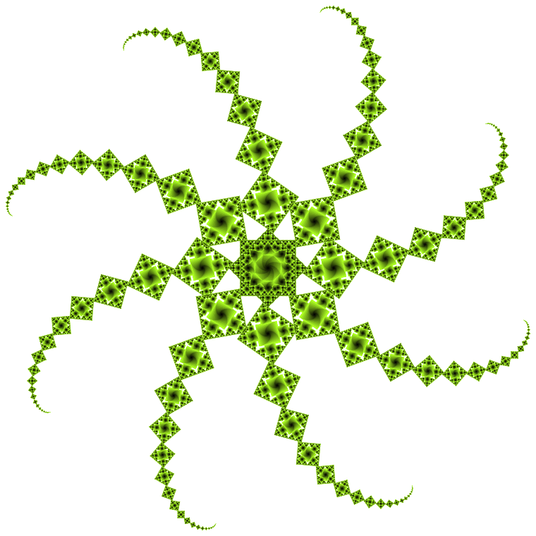
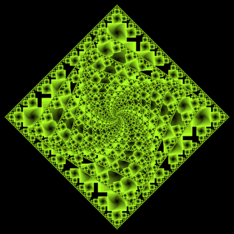
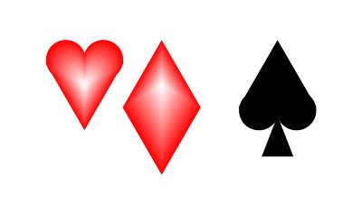

# ContextFree

Scripts for [Context Free Art](https://www.contextfreeart.org/index.html) — a design grammar for generating images from a small set of drawing rules.

This repo holds a personal collection of `.cfdg` scripts and their rendered output, plus a Docker image that wraps the [context-free](https://github.com/MtnViewJohn/context-free) command-line renderer (`cfdg`) so scripts can be rendered without installing anything locally.

See also: [Context Free generative art](https://blog.0x32.co.uk/posts/contextfree-generative-art/) — a blog post about this repo.

## Layout

- `scripts/*.cfdg` — Context Free Art source scripts (the grammar/DSL, not shell scripts).
- `Examples/*.png` — rendered output, one PNG per script in `scripts/`, matched by filename (e.g. `scripts/tree.cfdg` → `Examples/tree.png`).
- `docker_image/` — Dockerfile and Taskfile for building/pushing the `alastairhm/contextfree` image used to render scripts. See `docker_image/README.md` for details.
- `draw.sh` — convenience wrapper to render a script from the repo root using the Docker image.

## Requirements

- [Docker](https://www.docker.com/) — all rendering runs inside the `alastairhm/contextfree` image; no local `cfdg` install is needed.

## Rendering a script

From the repo root:

```bash
./draw.sh <size> <name>
```

For example:

```bash
./draw.sh 1024 fractal_tree
```

This renders `scripts/fractal_tree.cfdg` at 1024px and writes the result to `Examples/fractal_tree.png`, via:

```bash
docker run --rm -v ${PWD}:/mnt alastairhm/contextfree -s1024 -c "scripts/fractal_tree.cfdg" "Examples/fractal_tree.png"
```

The container mounts the repo root at `/mnt`, so paths are relative to the repo root, and `-c` centers the drawing.

If you haven't pulled/built the `alastairhm/contextfree` image yet, see `docker_image/README.md` for build instructions.

## Adding a new script

1. Add the `.cfdg` file to `scripts/`.
2. Render it with `./draw.sh <size> <name>` to generate the matching PNG in `Examples/`.
3. Commit both files together.

## Examples

A few of the rendered outputs in `Examples/`:

| | | |
|---|---|---|
|  |  |  |
|  |  |  |

## License

[MIT](LICENSE)

```
     _    _ __  __
    /\   | |  | |  \/  | Email    : alastair@montgomery.me.uk
   /  \  | |__| | \  / | Web      : https://blog.0x32.co.uk/
  / /\ \ |  __  | |\/| | Twitter  : @alastair_hm
 / ____ \| |  | | |  | | Mastodon : @Alastair@mastodon.me.uk
/_/    \_\_|  |_|_|  |_| (c) 2021
```
